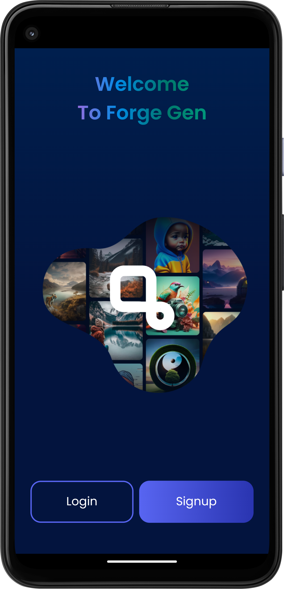
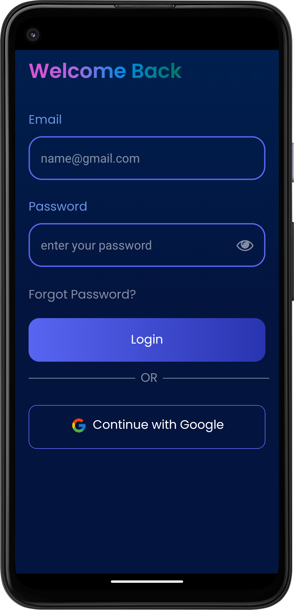
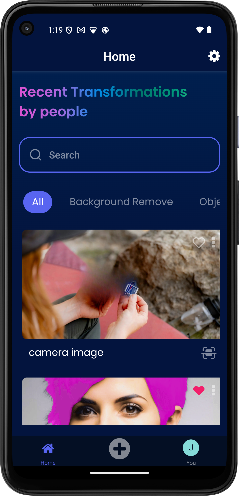
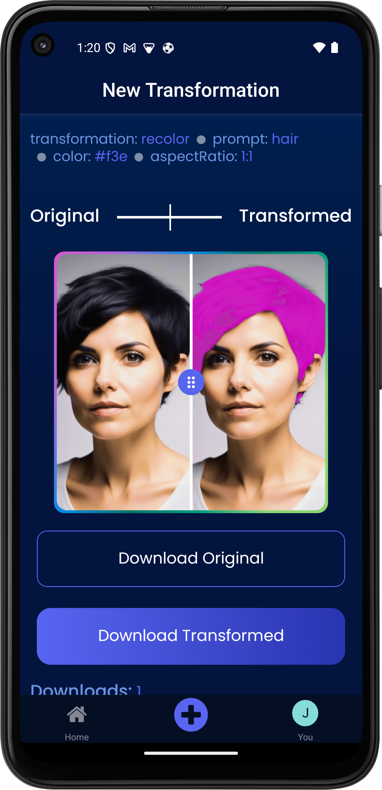
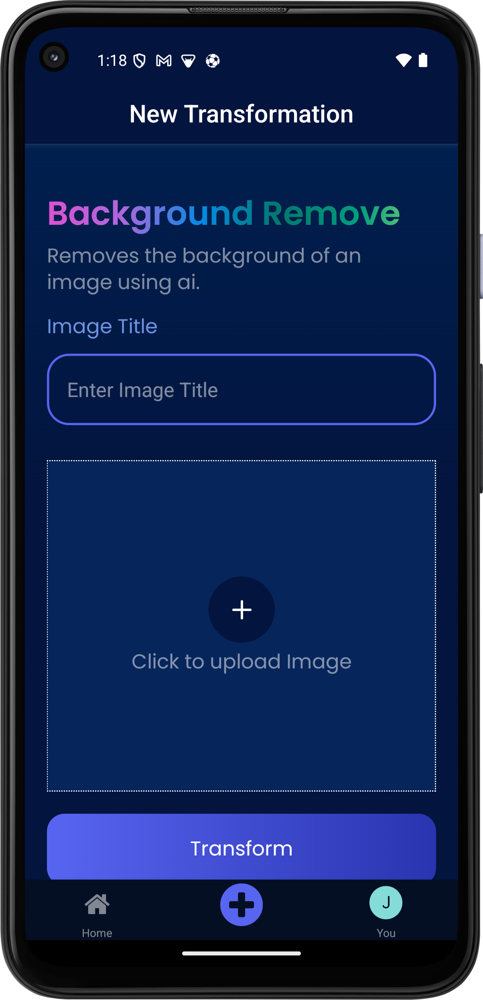
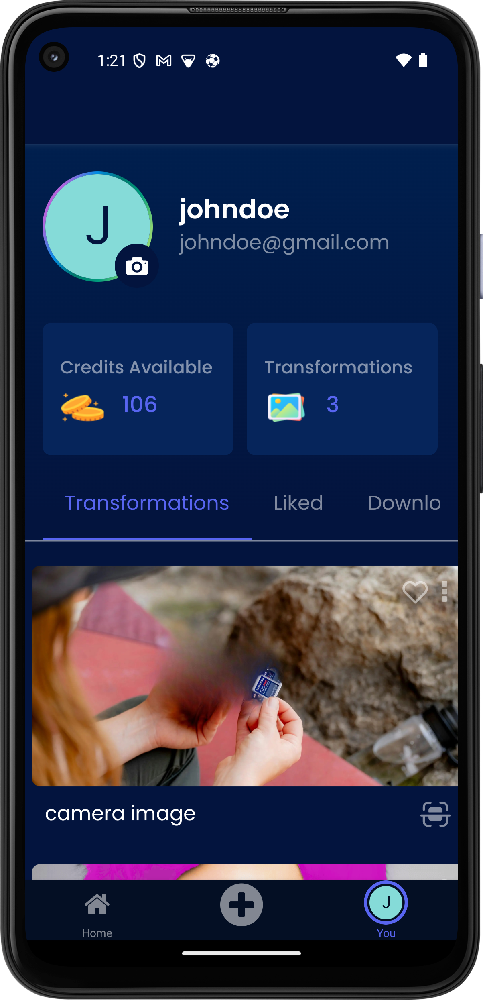
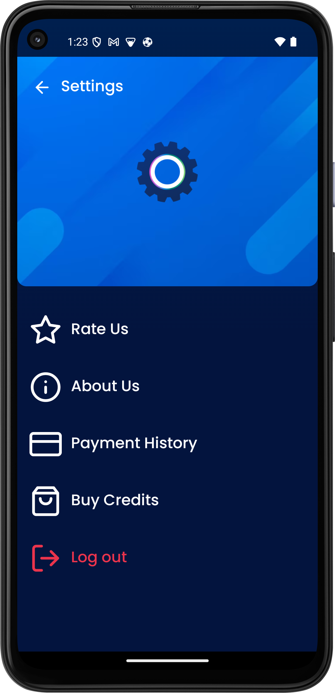
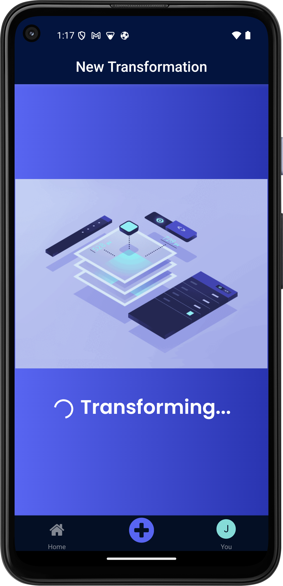

# 🚀 Forge Gen

An AI-powered mobile SaaS application built on top of Cloudinary's image transformation APIs, inspired by JS Mastery's Imaginify.

## 📲 Download App

**Note:** The app is only available on Android.

## 🛠️ Tech Stack

- **TypeScript**
- **Appwrite**
- **Cloudinary**
- **FlutterWave**
- **Expo**
- **React Native**
- **Expo Router**

## ScreenShots
<div style="display: flex; flex-direction: 'row'; flex-wrap: wrap; justify-content: center; gap: 6px">








</div>

## ✨ Key Features

- **Image Transformations**: Perform operations like background removal, image restoration, and object recoloring with ease.
- **Authentication**: Secure user login and registration.
- **Payments**: Payment integration with flutterwave for credit purchases
- **Credit Management**: Manage and track user credits for app services.

## 🎨 Design

Check out the figma design

[](<https://www.figma.com/design/fnO5bCB4xclViIhFDR7rLd/Forge-Pro---AI-Art-Generator-App-UI-Kit-(Community)?node-id=0-1&node-type=CANVAS&t=aPUdzA2heD5yBNno-0>)

## Mobile App Navigation Structure

This Folder Structure was derived due to the neccessity of colocating navigation logic with screens

```bash
  app/
  │ (only one allowed at root )
  ├── stack.tsx # Stack navigation logic
  ├── drawer.tsx # Drawer navigation logic
  ├── tabs.tsx # Tab navigation logic
  │
  ├── screens/ # Folder containing all screen files and folders
  │ ├── Home.tsx # A screen represented as a file
  │ ├── Profile/ # A screen represented as a folder
  │ │ ├── stack.tsx # Stack navigation for Profile section (only one allowed at root)
  │ │ └── screens/
  │      ├── [id].tsx # Dynamic screen for Profile section (e.g., User ID)
  │      ├── Edit.tsx # Static screen for Profile editing
  │ └── Settings.tsx # Another screen as a file
```

## Key Rules

1. **Root Level of Folders**:
   - At the **root level of any folder**, there can **only be one** of the following:
     - **`stack.tsx`**
     - **`tabs.tsx`**
     - **`drawer.tsx`**
   - These files define the navigation logic for that section.
2. **Screen Files**:
   - Screens can be either a **file** (React component) or a **folder** containing its own navigation logic.
   - If a folder is used, it must contain one of the navigation files (`stack.tsx`, `tabs.tsx`, or `drawer.tsx`) at its root.
3. **Dynamic Routes**:
   - Use **Next.js-style conventions** for dynamic routes.
   - Example: In the **`Profile`** folder, you can define a dynamic route with `[id].tsx` to create a dynamic profile screen for each user.
4. **Subfolders for Screens**:
   - Any folder that represents a screen must also contain a **`screens/`** subfolder to hold additional screens under that navigation.

## Example

- **`Profile` Folder**:
  - Contains `stack.tsx` for managing stack-based navigation.
  - Has a `screens` subfolder containing the actual screens, such as `[id].tsx` for a dynamic profile and `Edit.tsx` for profile editing.

```bash
Profile/
├── stack.tsx        # Stack navigation at the root
└── screens/
    ├── [id].tsx     # Dynamic screen for profile based on user ID
    └── Edit.tsx     # Static screen for editing profile
```

## 📦 Installation

To get started with Forge Gen locally, follow these steps:

1. **Clone the repository:**

```bash
   git clone https://github.com/nathan-somto/forge-gen.git
   cd forge-gen
```

2. **Create a cloudinary and appwrite account**
   [cloudinary]()
   [appwrite]()
3. **Get Your Environment variables for the cloudinary server and mobile app**

<details> <summary>Cloudinary Server Env</summary>

```bash
  CLOUDINARY_API_KEY=''
CLOUDINARY_API_SECRET=''
CLOUDINARY_CLOUD_NAME=''
```
</details>
<details> <summary>Mobile App Env</summary>

```bash
EXPO_PUBLIC_APPWRITE_PROJECT_ID=''
EXPO_PUBLIC_APPWRITE_DATABASE_ID=''
EXPO_PUBLIC_APPWRITE_USER_COLLECTION_ID=''
EXPO_PUBLIC_APPWRITE_TRANS_COLLECTION_ID=''
EXPO_PUBLIC_APPWRITE_BUCKET_ID=''
EXPO_PUBLIC_APPWRITE_TRANSACTIONS_COLLECTION_ID=''
EXPO_PUBLIC_FLUTTER_WAVE_PUBLIC_KEY=''
EXPO_PUBLIC_APPWRITE_FUNCTION_ID=''
```
</details>

2. **Install dependencies:**

```bash
    npm run get:packages
```

3. **Deploy Appwrite Functions**

```bash
  npm run deploy:functions
```

4. **Create a Development Build**

```bash
  cd mobile-app
  npm run (android | ios)
```

5. **Deploy Mobile App(Optional)**
   ensure you have eas installed locally and at the root level of the project run

```bash
 npm run deploy:app
```
